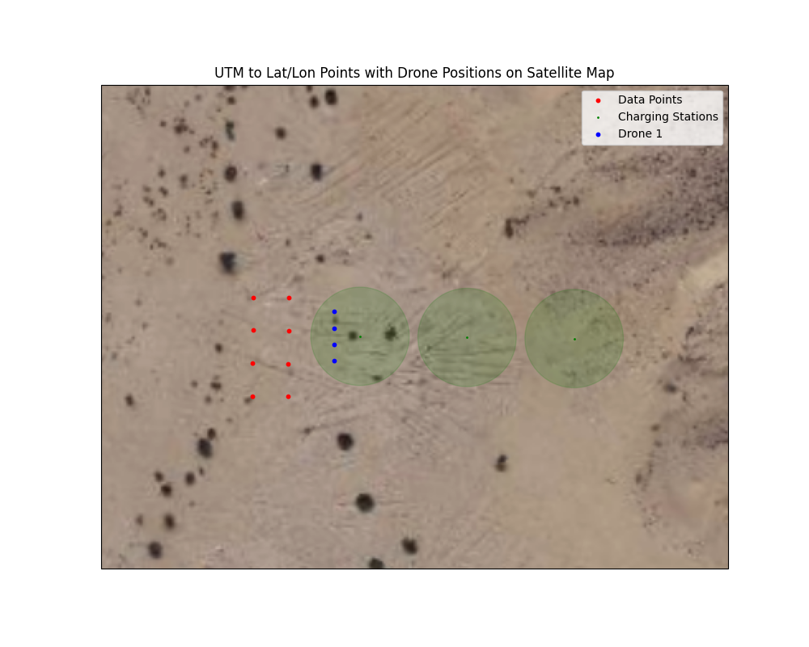
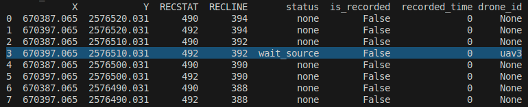
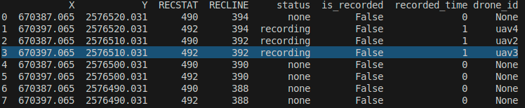
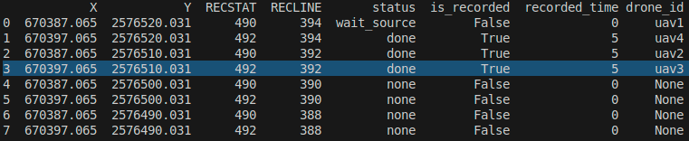

# Simulation Launch Instructions  

#### This functionality has been tested and tested on a demo mission with 4 drones. The source files are in the repository, and are already specified in the scripts.

## 1. Start Mission Evaluation Script  
After starting the simulation, execute the following command:  
```bash
roslaunch mission_evaluation node.launch
```  
This command runs the script to verify the recording points and check for battery recharging.  
You can observe how each function operates and understand what data needs to be published to specific topics.  

## 2. Key Script Details  
The script is located at:  
`/home/sim/to_git/UDH2025_robotics/catkin_ws/src/mission_evaluation/node.py`

### Step 1: Specify the Preplan File  
Provide the path to the prepared file containing the target points for recording:  
```python
line 22: self.preplan_file = "/home/sim/UDH2025_robotics/input_data/preplan_test.csv"
```  

### Step 2: Define Battery Charging Zones  
Create a file with the coordinates of the battery replacement zones in the following format (you can specify several ares):
```
X,Y,radius
670417.065,2576508.531,15
```  
- `X, Y` - UTM coordinates  
- `radius` - Area within which drone recharging is accounted for upon landing  

Specify the file path in the script:  
```python
line 46: self.charging_stations_file = "/home/sim/UDH2025_robotics/catkin_ws/src/drones_sim/mission/charging_stations.csv"
```  

Visualization of the data from the example: 



---

### Step 2.1: How to Recharge Battery? Steps to Recharge the Battery 

1. **Send the Drone to the Charging Zone**  
   - Navigate the drone to a predefined charging area (specified in your `charging_stations.csv` file).  
   - Ensure that the drone:  
     - Lands successfully.  
     - Disarms (propellers must stop spinning).  
     - Is within the designated radius of the charging zone.  

2. **Invoke the Charging Function**  
   Call the following function in your script (example px4_drone.pt, line:409):  
   ```python
   self.battery.charge()
   ```  
   - This function will automatically send the drone's data and receive a response.  

3. **Successful Recharge**  
   - If the response is positive, the variable `self.battery.time` should automatically update to `1200 sec` (20 minutes).  

4. **Flight Time Calculation**  
   - The flight time is tracked only while the drone is **ARMED**.

5. **The battery is recharged instantly!!!**

## 3. Verifying Seismic Data Recording  

**Important:**  
The seismic source activates every **30 seconds**.  

When a drone lands at the target point, publish a message at which point drone will record data in the String format to the `/recording_points` topic:  
```
RECSTAT, RECLINE, uav_id
```  
Example:  
```
"490,394,1"
```  
- `RECSTAT` and `RECLINE` - From `preplan.csv`  
- `uav_id` - Drone number  

---
 
The script will automatically verify if the drone recording the specified point:  
- If the distance between the landed drone and the target point is **less than 5 meters**, the point status changes to **"wait_source"** (waiting for seismic source activation).  



- Once the source is activated, the point enters **"recording"** mode.  



- After recording for **20 seconds**, the status changes to **"done"**, and the `is_recorded` flag is raised.  



This information is then published to the `recording_result` topic.  
In our example, the drone waits for this message to proceed with the mission:  
- **Relevant Code References:**  
  - Function definition:  
    ```python
        def recording_result_callback(self, msg):
        """
        Process the received message, extract the UAV number, and check conditions.
        """
        try:
            message_data = eval(msg.data)
            # Extract fields from the message
            uav_number = message_data[-1]  # 'uav3' is the last element
            status = message_data[4]       # status is the 5th element
            # Check if the message is for the given UAV ID
            if str(self.uav_name) in uav_number:
                rospy.loginfo(f"Message for UAV {self.uav_name}: {msg.data}")
                # Check if the status is 'done'
                if status == 'done':
                    rospy.loginfo(f"'done' status detected for UAV {self.uav_name}!")
                    self.is_recording = False
        except Exception as e:
            rospy.logerr(f"Error processing message: {e}")
    ```  

You can implement a simple wait mechanism using `time.sleep`, or create your custom data recording verification logic.